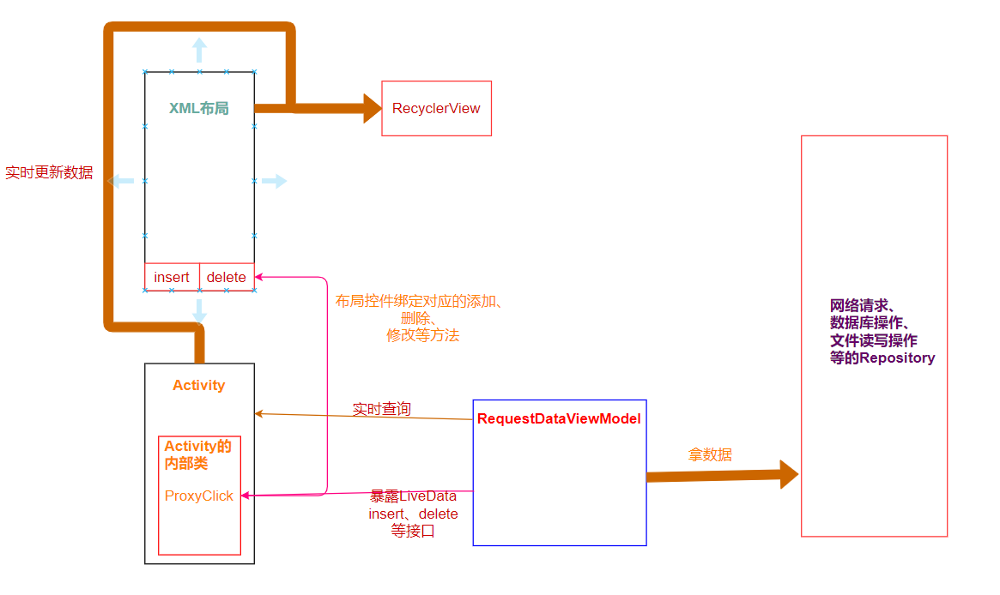

##   ◭说明:

本Demo旨在使用Rxjava操作Android JetPack Room 数据库，之前自己已经出了一版关于使用Kotlin Coroutines操作room数据库的Demo,[点这里进入第一版](https://github.com/Edwardwmd/KotlinAppFramework) 。在日常开发中，我想很多企业都在使用Rxjava这个库的，所以这个库也是有针对性的点出Room的一些问题。这个Demo主要涉及了自己普通式创建本地数据库和在Assets已有数据库的基础上在本地创建数据库，主推数据增删改查，特殊一点的有关键字的模糊查询等。直接上Demo演示吧：

### 2021年7月24更新:

此次更新了结合LiveData+Room+Coroutines+ViewModel+Databining实现简单的MVVM小Demo，旨在练习关于Android JetPack库的相关知识，此架构清晰简单且具备实时更新数据的效果（LiveData的功劳），下面是关于这个小库的演示和结构说明：

